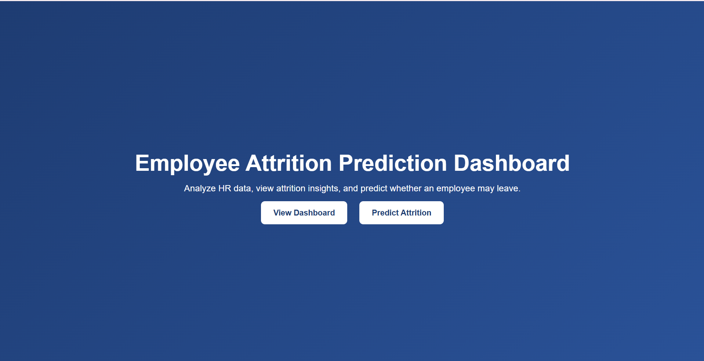
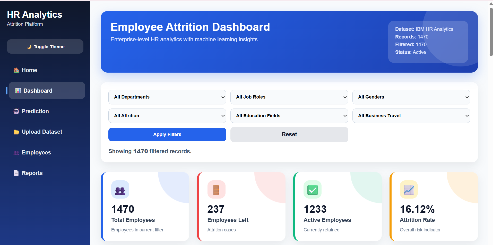
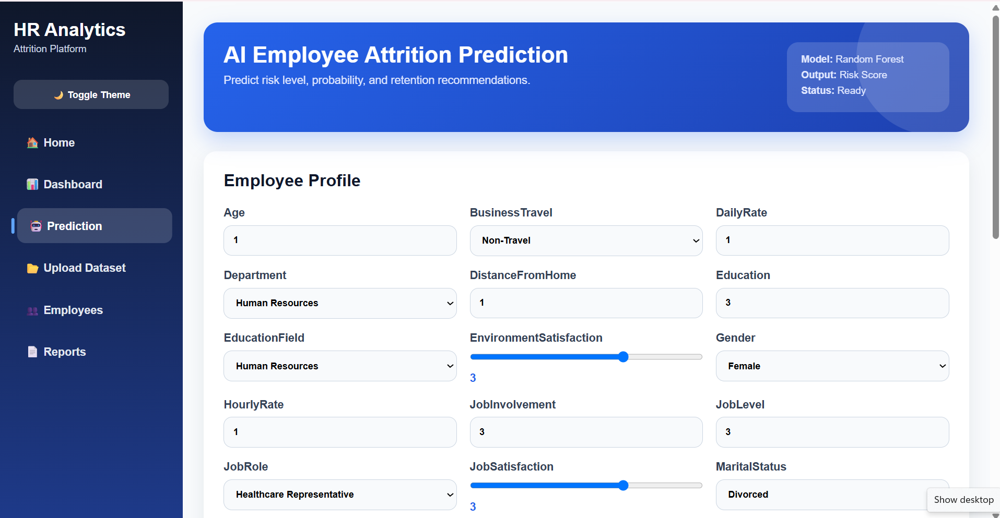
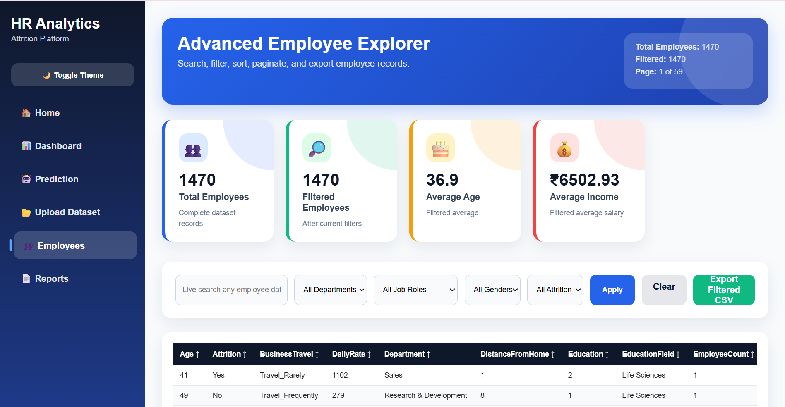
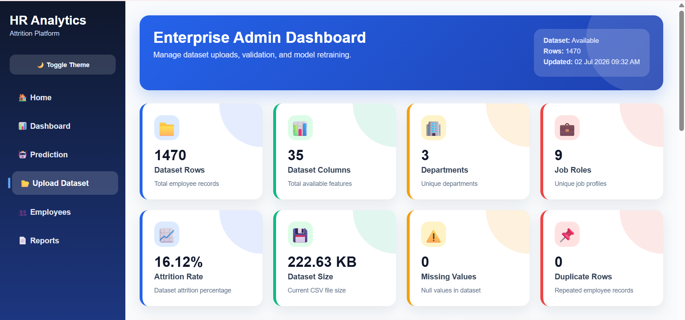
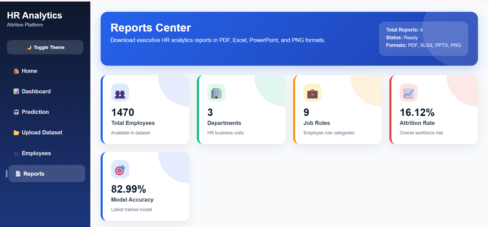

# 👨‍💼 Employee Attrition Prediction Dashboard

<p align="center">


</p>

An **Enterprise Employee Attrition Prediction Dashboard** built using **Flask**, **Machine Learning**, **Scikit-learn**, **Plotly**, and **Python**.

The application helps HR professionals analyze employee attrition, predict employee turnover using Machine Learning, visualize HR insights through interactive dashboards, and generate professional reports in **PDF**, **Excel**, **PowerPoint**, and **PNG** formats.

---

# 🚀 Live Demo

**Render Deployment**

> Add your Render URL here after deployment.

---

# 📸 Application Preview

## 🏠 Home Page



---

## 📊 Enterprise Dashboard



---

## 🤖 AI Prediction Dashboard



---

## 👥 Employee Explorer



---

## 📂 Admin Dashboard



---

## 📄 Reports Center



---

# ✨ Features

## 📊 Executive Dashboard

- Interactive KPI Cards
- Employee Statistics
- Attrition Rate Analysis
- Executive Insights
- Department Analytics
- Job Role Analytics
- Overtime Analysis
- Gender Analysis
- Monthly Income Analysis
- Promotion Analysis
- Correlation Heatmap
- Feature Importance
- Prediction Probability Distribution
- Interactive Plotly Charts

---

## 🤖 Machine Learning

- Employee Attrition Prediction
- Random Forest Classifier
- Automatic Model Retraining
- Prediction Probability
- Risk Classification
- AI Recommendations
- Prediction History
- Download Prediction Report

---

## 👥 Employee Explorer

- Live Search
- Advanced Filters
- Sorting
- Pagination
- Export Filtered CSV
- Responsive Table
- Summary Statistics

---

## 📂 Enterprise Admin Panel

- Upload HR Dataset
- Automatic Model Retraining
- Dataset Validation
- Missing Value Detection
- Duplicate Detection
- Model Performance Metrics
- Activity Log

---

## 📄 Report Generation

Generate professional reports in multiple formats:

- 📄 Executive PDF
- 📊 Excel Analytics Report
- 📽 PowerPoint Presentation
- 🖼 Dashboard Snapshot (PNG)

---

## 🎨 Professional UI

- Enterprise Dashboard
- Responsive Layout
- Dark Mode
- Animated KPI Cards
- Interactive Sidebar
- Loading Spinner
- Custom Error Pages
- Professional Reports Center

---

# 🛠 Technology Stack

## Frontend

- HTML5
- CSS3
- JavaScript
- Plotly

## Backend

- Flask
- Python

## Machine Learning

- Scikit-learn
- Pandas
- NumPy
- Joblib

## Reports

- ReportLab
- OpenPyXL
- Python-PPTX
- Pillow

---

# 📂 Project Structure

```
employee-attrition-prediction-dashboard
│
├── dataset/
│   └── WA_Fn-UseC_-HR-Employee-Attrition.csv
│
├── model/
│   ├── attrition_model.pkl
│   ├── scaler.pkl
│   ├── label_encoders.pkl
│   ├── features.pkl
│   ├── feature_importance.pkl
│   └── model_metrics.json
│
├── reports/
│
├── screenshots/
│   ├── home.png
│   ├── dashboard.png
│   ├── prediction.png
│   ├── employee_explorer.png
│   ├── admin_dashboard.png
│   └── reports_center.png
│
├── static/
│   └── style.css
│
├── templates/
│   ├── index.html
│   ├── dashboard.html
│   ├── predict.html
│   ├── employees.html
│   ├── admin.html
│   ├── reports.html
│   ├── 404.html
│   └── 500.html
│
├── app.py
├── train_model.py
├── requirements.txt
├── Procfile
├── README.md
└── .gitignore
```

---

# 📊 Dashboard Modules

### Executive Dashboard

- Total Employees
- Active Employees
- Attrition Count
- Attrition Rate
- Average Age
- Average Monthly Income
- Average Years at Company
- Promotion Analysis
- Executive Insights

---

### Machine Learning Dashboard

- Accuracy
- Precision
- Recall
- F1 Score
- ROC-AUC
- Feature Importance
- Probability Distribution

---

### Employee Explorer

- Live Search
- Department Filter
- Job Role Filter
- Gender Filter
- Attrition Filter
- Export CSV

---

### Reports Center

- Executive PDF
- Excel Analytics
- PowerPoint Presentation
- Dashboard Snapshot

---

# 📁 Dataset

IBM HR Analytics Employee Attrition Dataset

Dataset includes:

- Employee Demographics
- Salary Information
- Job Details
- Performance Metrics
- Work-Life Balance
- Promotion History
- Attrition Status

---

# ⚙ Installation

Clone repository

```bash
git clone https://github.com/Aadvik7462/employee-attrition-prediction-dashboard.git
```

Go to project

```bash
cd employee-attrition-prediction-dashboard
```

Create virtual environment

```bash
python -m venv venv
```

Activate environment

Windows

```bash
venv\Scripts\activate
```

Install dependencies

```bash
pip install -r requirements.txt
```

Train Machine Learning model

```bash
python train_model.py
```

Run Flask application

```bash
python app.py
```

Open browser

```
http://127.0.0.1:5000
```

---

# 🌍 Deployment

This project is deployment-ready for **Render**.

### Build Command

```text
pip install -r requirements.txt
```

### Start Command

```text
gunicorn app:app
```

---

# 🚀 Future Enhancements

- User Authentication
- Role-Based Access Control
- SQL Database Integration
- REST API
- Email Alerts
- Real-time Dashboard
- Docker Support
- Cloud Storage
- Employee Profile Management

---

# 👨‍💻 Author

## **Aadvik Singh**

**Electronics & Communication Engineering**

Machine Learning • Data Analytics • Python • Flask

### GitHub

https://github.com/Aadvik7462


# ⭐ Support

If you found this project useful, please consider giving it a **⭐ Star** on GitHub.

---

# 📜 License

This project is licensed under the **MIT License**.

---

<p align="center">

Made with ❤️ using Flask, Machine Learning, Plotly & Python

</p>